# <font color=#39c5bb>番剧列表：</font>


### <font color=#ffff00>***赛马娘18***</font>
> 状态:    

> 从出道赛胜出后，才能入正式比赛，G3比赛资格，之后再是G2，G1。    
> <font color=#66ff99>经典三冠(皐月、德比、菊花)中胜出，还有雌三冠(樱花、橡树、秋华)，春古马三冠(大阪、春天皇、宝塚)与秋古马三冠(秋天皇、日本杯、有马)。</font>


### <font color=#ffff00>***我独自升级24*** </font>

> 状态:    

> <font color=#66ff99>Level up！</font>
> <font color=#66ff99>1、2季</font>
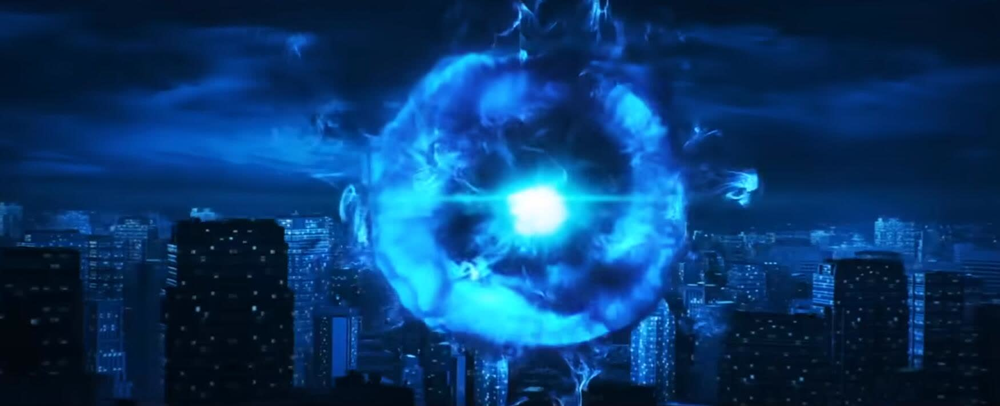


### <font color=#ffff00>***鬼灭之刃16*** </font>

> 状态:    

> <font color=#66ff99>立志、无限列车、游郭、刀匠篇完<font>
> <font color=#66ff99>柱训练<font>
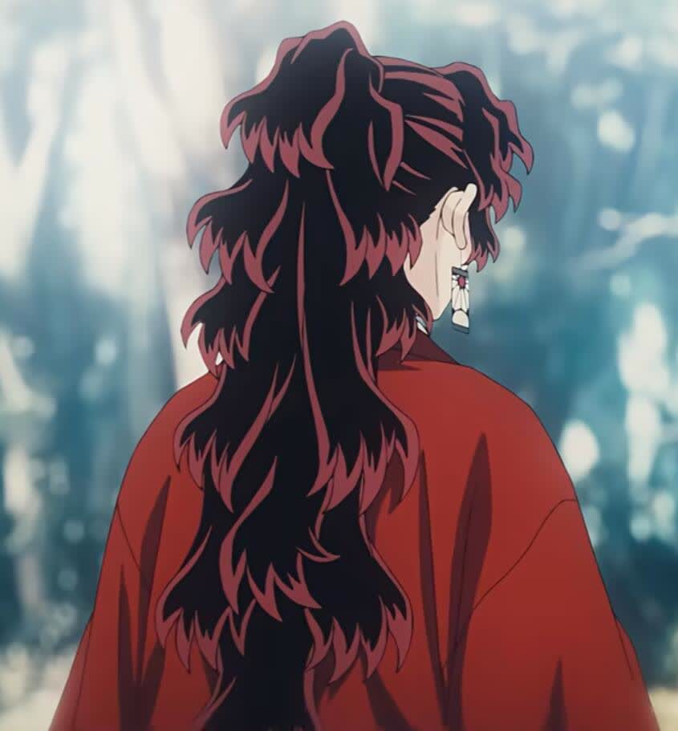


### <font color=#ffff00>***为美好的世界献上系列15***</font>

> 状态:    

> <font color=#ff0000>爆焰、祝福（1、2），红传说，祝福(3)</font>    
> <font color=#ff0000>Explosion</font>    

<video width="500" controls>
  <source src="./res/为美好世界献上爆焰.mp4" type="video/mp4">
  Your browser does not support the video tag.
</video>


### <font color=#ffff00>***Grils band cry24***</font>

> 状态:    

> <font color=#66ff99>Tomo...</font>

<video width="500" controls>
  <source src=".\res\GrilBandCry.mp4" type="video/mp4">
  Your browser does not support the video tag.
</video>


### <font color=#ffff00>***怪兽8号24***</font>

> 状态:    

> <font color=#66ff99>完</font>


### <font color=#ffff00>***迷宫饭24*** </font>

> 状态:    

> <font color=#66ff99>24完</font>

<video width="500" controls>
  <source src=".\res\迷宫饭.mp4" type="video/mp4">
  Your browser does not support the video tag.
</video>


### <font color=#ffff00>***葬送的芙莉莲23***</font>

> 状态:    

> <font color=#66ff99>花海盛开，故人归来</font>

<video width="500" controls>
  <source src="./res/葬送的芙莉莲.mp4" type="video/mp4">
  Your browser does not support the video tag.
</video>


### <font color=#ffff00>***间谍过家家22*** </font>

> 状态:    

> <font color=#66ff99>至第二季完，小电影完</font>
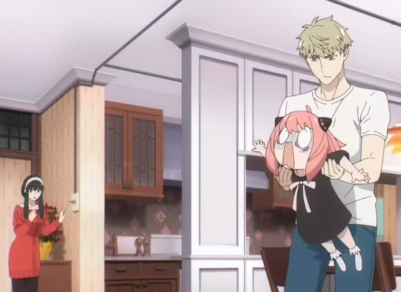


### <font color=#ffff00>***仙王的日常生活22*** </font>

> 状态:    

> <font color=#66ff99>第1、2、3季完</font>
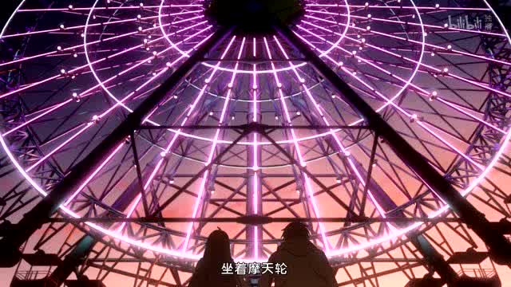


### <font color=#ffff00>***奇幻世界舅舅22*** </font>

> 状态:    

> <font color=#66ff99>伊玖拉斯 艾尔兰</font>
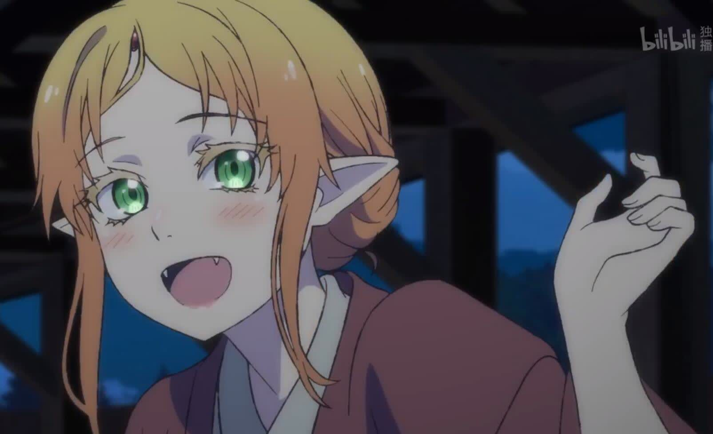


### <font color=#ffff00>***夏日重现22*** </font>

> 状态:    

<video width="500" controls>
  <source src="./res/夏日重现op部分.mp4" type="video/mp4">
  Your browser does not support the video tag.
</video>


### <font color=#ffff00>***异世界药局22*** </font>

> 状态:    

> <font color=#66ff99>化学医学魔法异世界<font>
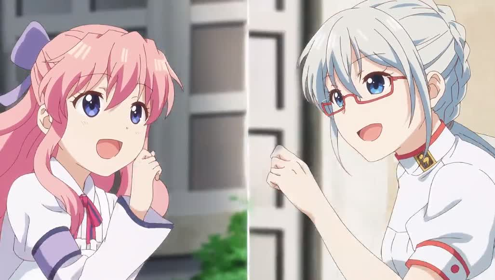


### <font color=#ffff00>***契约之吻22*** </font>

> 状态:    

> <font color=#ffff88>可爱可爱可爱可爱，就算是恶魔也好可爱！上天啊，让我也和恶魔签订契约吧！</font>


### <font color=#ffff00>***堀与宫村21*** </font>

> 状态:    

> <font color=#ff8800>堀：你会家暴吗？宫村：不会。堀：那你不会学吗？</font>
> <font color=#ff8800>SM</font>


### <font color=#ffff00>***总之就是非常可爱1、2(20*** </font>

> 状态:    

> <font color=#ff8800>总之就是非常酸</font>


### <font color=#ffff00>***魔女之旅20*** </font>

> 状态:    

> <font color=#eeeeee>沙耶天堂</font>
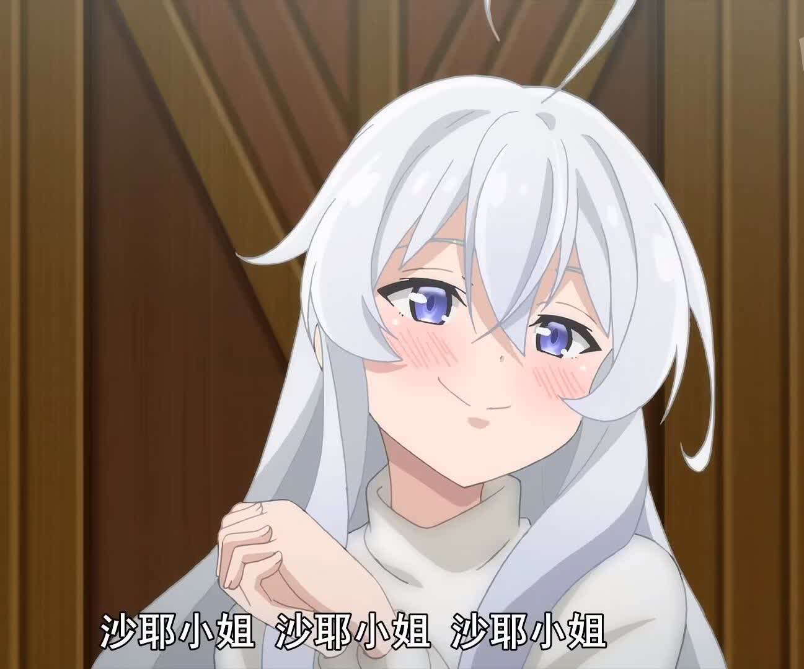


### <font color=#ffff00>***辉夜大小姐想让我告白19*** </font>

> 状态:    

> <font color=#66ff99>1、2、3季完<font>

<video width="500" controls>
  <source src="./res/辉夜大小姐想让我告白.mp4" type="video/mp4">
  Your browser does not support the video tag.
</video>


### <font color=#ffff00>***刺客伍六七18*** </font>

> 状态:    

> <font color=#66ff99>1、2、3、4季完<font>    
> <font color=#66ff99>原来都有大号，只是喜欢玩小号<font>    
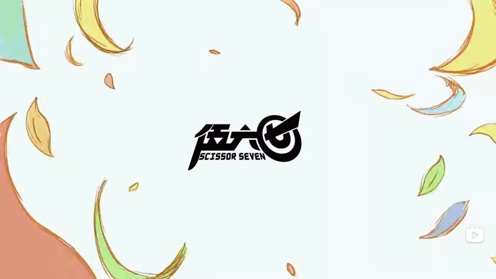


### <font color=#ffff00>***物理魔法使1,2(17*** </font>

> 状态:    

> <font color=#66ff99>完</font>
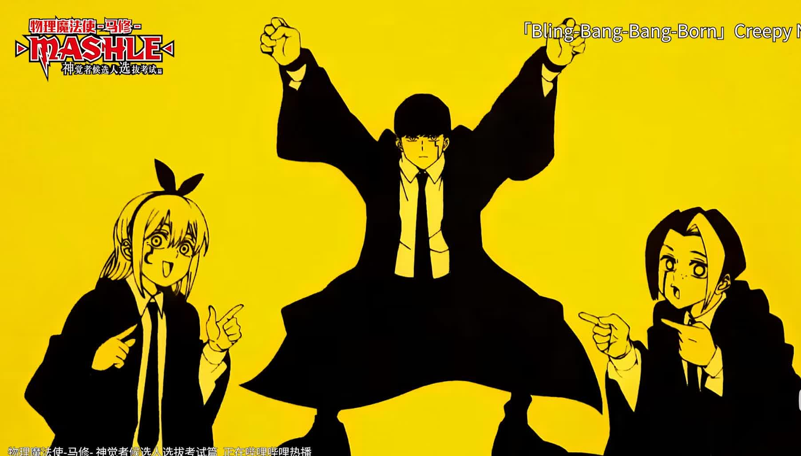


### <font color=#ffff00>***打工吧魔王大人1、2(13*** </font>

> 状态:    

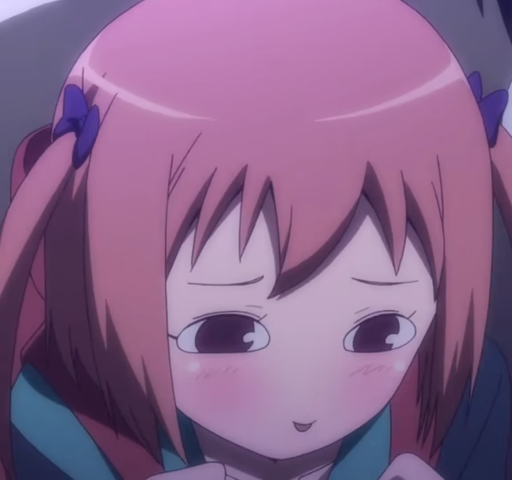


### <font color=#ffff00>***进击的巨人13*** </font>

> 状态:    

> 1、2、3、最终季上下完    
> <font color=#ff0000>自由对于你来说意味着什么？谏山创：I don't know.<font>    
> <font color=#00ffff>人只有在追求自由的道路才是自由的。<font>    

> <font color=#ff00ff>呐……对面的敌人<font>    
> <font color=#ff00ff>全部杀光了<font>    
> <font color=#ff00ff>我们能获得自由吗？<font>    
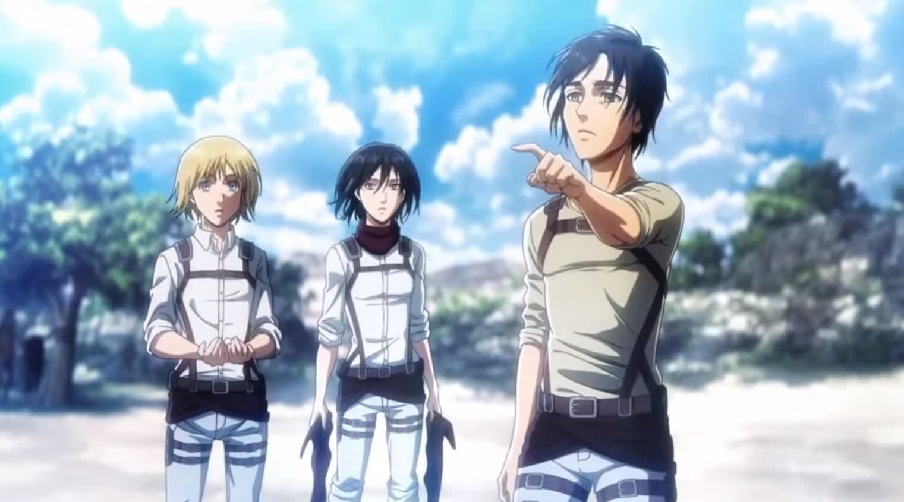


### <font color=#ffff00>***中二病也要谈恋爱12*** </font>

> 状态:    

> <font color=#ff88ff>明明……是我先来的……</font>
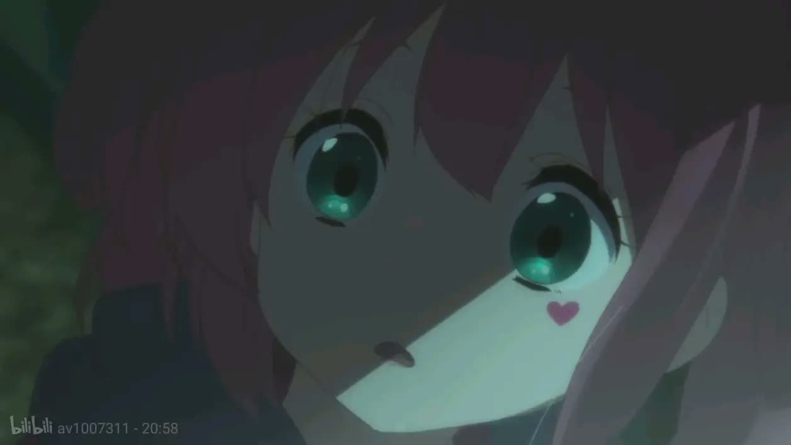


### <font color=#ffff00>***某科学魔法系列08*** </font>

> 状态:    

> <font color=#66ff99>时间线：    
> <font color=#66ff99>《某科学的超电磁炮》    
> <font color=#66ff99>《某魔法的禁书目录》1-9话    
> <font color=#66ff99>《某科学的超电磁炮S》1-16话    
> <font color=#66ff99>《某魔法的禁书目录》10-17话    
> <font color=#66ff99>《某科学的超电磁炮S》17-24话    
> <font color=#66ff99>《某魔法的禁书目录》18话    
> <font color=#66ff99>《某魔法的禁书目录Ⅱ》1话    
> <font color=#66ff99>《某魔法的禁书目录》19-20话    
> <font color=#66ff99>《某科学的一方通行》    
> <font color=#66ff99>《某魔法的禁书目录》21-24话    
> <font color=#66ff99>《某魔法的禁书目录Ⅱ》2-7话    
> <font color=#66ff99>《某魔法的禁书目录剧场版 恩底弥翁的奇迹》    
> <font color=#66ff99>《某科学的超电磁炮T》1-15话    
> <font color=#66ff99>《某魔法的禁书目录Ⅱ》8-16话    
> <font color=#66ff99>《某科学的超电磁炮T》16-25话    
> <font color=#66ff99>《某魔法的禁书目录Ⅱ》17-24话    
> <font color=#66ff99>《某魔法的禁书目录Ⅲ》    
</font>


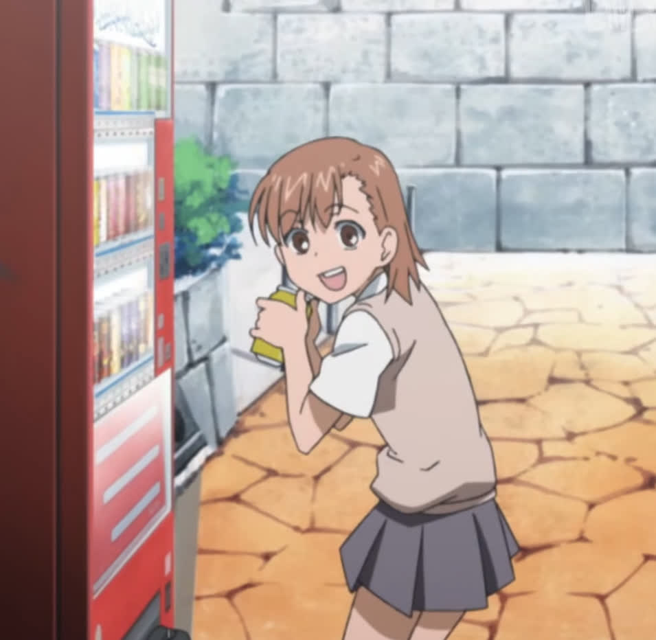


### <font color=#ff0000>***------禁片------*** </font>

### <font color=#88888>***憧憬魔法少女23*** </font>

> 状态:    

> <font color=#ffff88>预13集（至13</font>
> 对性认识的观念……差别太大了……
> 更新时间每周四23：30


### <font color=#888888>***边缘行者22*** </font>

> 状态:    

> <font color=#ffff88>在夜之城没有人是活着的传奇，所以凭什么Lucy活着，Rebecca要被这样轻描淡写地惨死啊！<font>
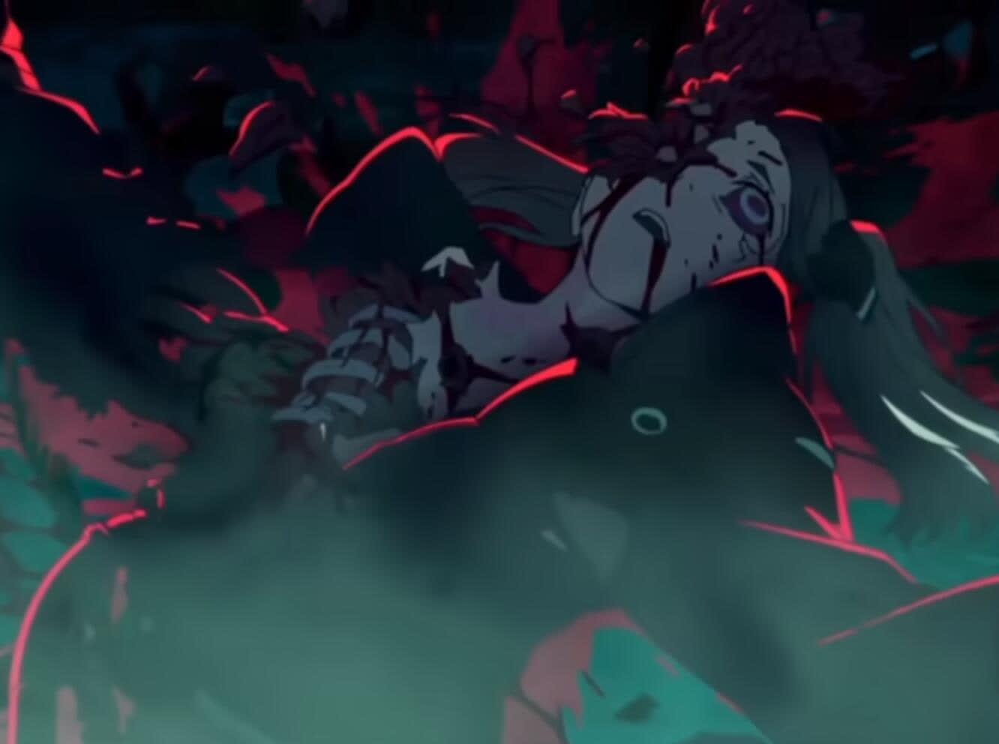


### <font color=#888888>***缘之空10*** </font>

> 状态:    

> <font color=#ffff88>平行世界：一叶(渚)篇、瑛篇、奈绪线、穹线（主线）、初佳线</font>

<div style="display:flex;">


</div>


### <font color=#ff0000>***-----------*** </font>
[comment]:********************************
[comment]://///////////////////////////////


# <font color=#39c5bb>See also：</font>


# <font color=#39c5bb>故事回顾跳转表：</font>

### <font color=#39c5bb>缘之空</font>
```markdown

	<此片通过出于女孩们的愿望建立平等世界线来讲述人物的故事>

	  一叶（渚）线、瑛线：
	  瑛和渚是同父异母的姐妹，但瑛和渚的母亲在
	同一天由同一个医院接生（春日野医院），导致
	有记录认为瑛和渚可能抱错，在悠的推动下，事
	实得到了证明，也就是并没有抱错。瑛的母亲死
	了，她的父亲出于身份的原因，不公开瑛是他的
	女儿，但是她的父亲在无形中默默支持着瑛（巧
	得根本就不可能)。

	  奈绪线：
	    奈绪小时候因为家里父亲被认为出轨，导致
	奈绪小时候压力大无助，于是找到了悠，通过强
	奸春日野悠来释放自己的压力。长大后又遇到了
	悠，但是穹害怕被抛弃，不认同奈绪，但最后因
	为奈绪在雷火中取出穹的妈妈留给穹的布娃娃，
	得到了穹的认同。

	  春日穹线（主线）；
	    穹因为生病，长大后，直到有意识了，才与
	悠见面。作为孪生兄妹，却以同龄人的身份出现，
	使穹成为了对于悠来说的一个特别的存在，便有
	了之后的感情的发展。在悠粗暴地结束与奈绪的
	感情。确认了对穹的感情后，他们的感情得到了
	发展，但中途因为悠在意别人的看法。在最后，
	悠认为要为自己的情感而活，离开了不认同他们
	的小镇去往外国。（反观班长：只要有情感就够
	了吗？要是这样的话我也有好多想做的。

	  初佳线：片尾的一条平行世界线。

	  穹线观点：
	    为了感情而活。人在追求自由的时候才是自由
	的，悠和穹为了追求之间的感情而活他们是自由的，
	在自由中人是幸福的。像班长守旧的观点认为的不
	一定能得到自己想要的幸福。首先孩子并不是幸福
	的必需品，其次兄妹之间可能有正常的孩子的，再
	次不能有之间的孩子还可以退而求其次有各自的孩
	子，在此基础上去碰概率，有之间的正常孩子。他
	们始终自由，始终幸福。有些人按班长的观点走了，
	不幸福，或者幸福了但遇到意外，其它的就是幸福
	的没意外的。假如不追求孩子的人婚姻，就没有身
	份的限制了。追求孩子的婚姻，身份特殊也有方法。
	问题只有群体的认可了，不进群体就没有什么问题了。
	
```

### <font color=#39c5bb>夏日重现</font>
```markdown

	  从前有只鲸鱼的影子搁浅，被一个女孩发现后，变
	为了女孩的影子，并消除了原型，在当时的饥荒中，将
	岛上的许多人变为了影子，从而渡过了饥荒。后来的战
	争中，波稻也就是女孩，受了重创。原女孩的父亲纸垂
	一直利用她的能力想实现永生，但意识到自己将会迎来
	死亡，便妄想将地球毁灭见证自己的终幕，便开始了计
	划。但在他的计划过程中，波稻的另一部分变为了潮，
	和真的潮一起发现了影子，但过程中真的潮死亡，影子
	潮给日鹤发消息告知原由让她来岛上，找网代慎平。慎
	平也由于小舟潮的死亡回到岛上，遇上了影子病，并调
	查，看见了纸垂的终幕，死后，发现自己有回到过去的
	能力，于是不断试错，和影子潮一起循环，最后潮消除
	了最开始的鲸，阻止了纸垂的终幕。之后网代慎平回到
	第一次进入循环的时间点，影子带来，影响的一切都消
	失不见。慎平将梦告诉日鹤，日鹤写了本夏日重现的故
	事。
```

# **音乐列表：**
### **放睛(auto)**
[考虑加不加标签]:autoplay 
<audio controls id="AutoAudio" loop preload="metadata" src="./res/放晴.mp3"></audio>

