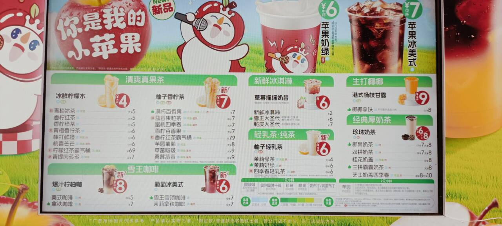

# :sparkles: 点单 :sparkles:

# :sparkles: 规则 :sparkles:

* :star2: 手帕 :star2:
> 消毒水泡5分钟 
> 制消毒水:10L+1片消毒片 

|绿|蓝|黄|粉|
|---|---|---|---|
|食品|非食品|手,杯子|冰淇淋|

* :star2: 杯型 :star2:

|霸气桶|大杯|中杯|U型杯|小圣代杯|咖啡杯|
|---|---|---|---|---|---|
|950ml|660ml|506ml|420ml|300ml|420ml/505ml|

* :star2: 期卡 :star2:
> 配用食物的有效期

# :sparkles: 前场 :sparkles:
* :star2: 标签 :star2:

|数字|糖蜜|
|---|---|
|g|果糖|
|n|奶|
|c|橙片|
|l|奶绿|
|||

