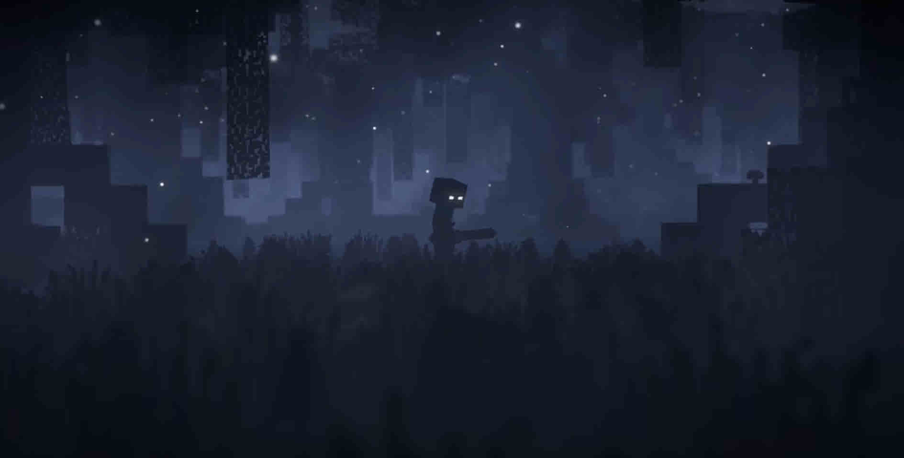
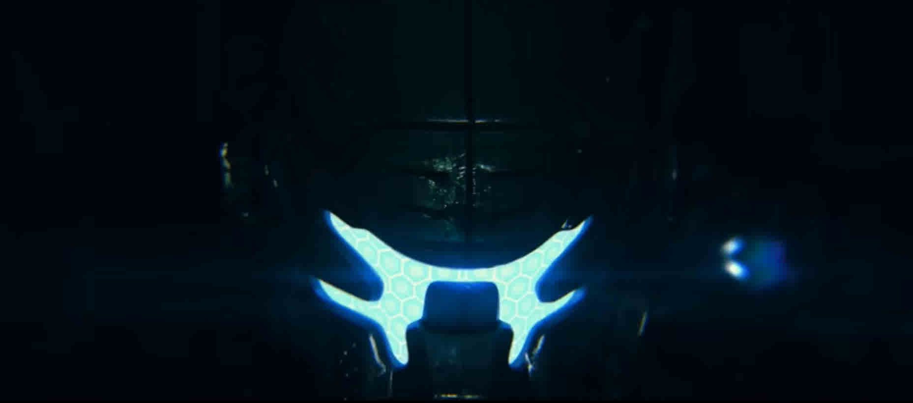
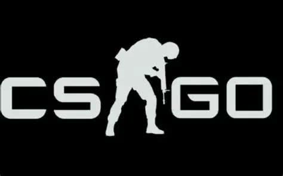
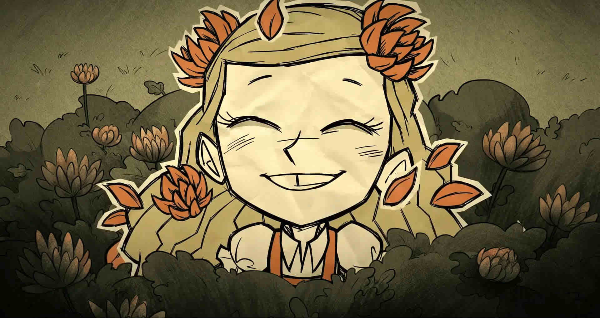
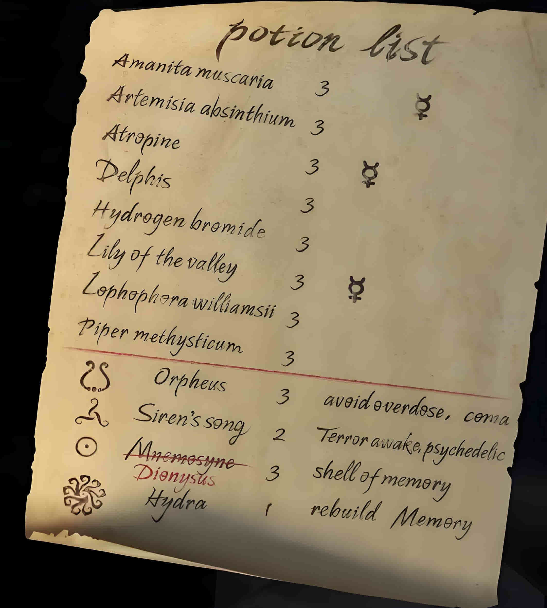

# 目录：

### MC(Minecraft)
> 攻击：3格距离, 滚轮改攻击高cps+wtap 
> 走位：向侧脸的方向走,向低处走(低打高) 
> 搭路：蹲起搭,蹲跳搭,斜搭  

> 物品栏:

|键位|1|2|3|4|5|z|x|c|v|
|---|---|---|---|---|---|---|---|---|---|
|项目    |伤害    |击退(KB)|道具/药水/空手位|自救|食物      |方块|工具|远伤|位移|
|理想配置|合金武器|鱼竿    |岩浆桶          |水桶|附魔金苹果|方块|镐  |弓  |珍珠|

 

> 最大附魔:

|剑|斧|弓|镐|戟|
|---|---|---|---|---|
|经验修补1|经验修补1|经验修补1|经验修补1|经验修补1|
|消失诅咒1|消失诅咒1|消失诅咒1|消失诅咒1|消失诅咒1|
|锋利5/节肢杀手5/亡灵杀手5|锋利5/节肢杀手5/亡灵杀手5|力量5||穿刺5|
|火焰附加2|时运3/精准采集1|无限1|时运3/精准采集1|引雷1/激流3/忠诚3|
|耐久3|耐久3|耐久3|耐久3|耐久3|
|抢夺3|效率5|火矢1|效率5||
|击退2||冲击2|||
|横扫之刃3|||||

> 护甲值:每点最高4%伤害减免(max:80%)
> 保护:每级4%伤害减免,不同装备可叠加(max:64%)

> other bindkey:

|背包|b|
|---|---|
|扔|q|
|跑|右鼠键|
|蹲|左鼠键|
|跳|space|
|视角切换|r|
|攻击|f|
|使用|g|
|移动|WASD|

> 游戏:征服主世界->地狱->末地

### TTF2泰坦陨落
> \<钢铁洪流\>
> BT7274:协议三：保护铁驭。    

> 键位可仿MC    
> 起源引擎移动：加速蹲跳    
> 浪人要封刀    

> 剧情:干掉apex雇佣兵,夺取圣柜,保护哈莫尼星    

### CSGO/CS2
> 键位可仿MC    
> 急停,以精准打头    

### 饥荒
> \<学第一门脚本lua的开端\>    
> 查理会想你的...    

### DoorKickers
> \<CQB\>    

<video width="500" controls>
  <source src="./res/DoorKickers.mp4" type="video/mp4">
  Your browser does not support the video tag.
</video>

### 英雄联盟
> \<在线多人跟打器\>

### 第五人格
> 水银,七竖琴,赛壬,缪丝外,缪丝内(九头蛇,许德拉)

# ————————————————    
# 待补档

### 原神
>     

### OSU

### PJSK
> 啤酒烧烤,MIKU赛高

### Phigros

### 明日之后
> 

### 赛马娘
> 

###  Gal games 
> ————————————————————————————————     
> 

